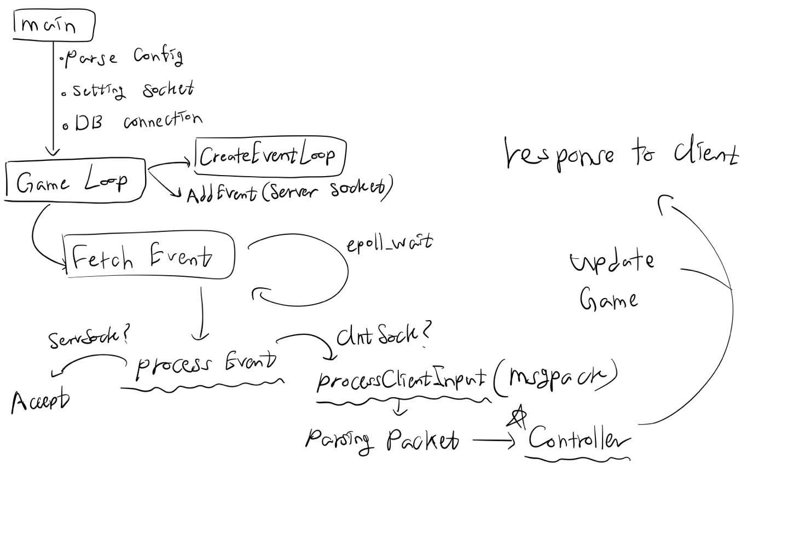

# TicTacToe Game(Server and Client)
tictactoe를 즐길 수 있는 클라이언트와 서버

# Stack 
Server : C++, Mysql, redis   
Client : 제작예정(Unity예상)  

# Architecture 


# Porotocol 
Read The Protocol Document   
[Protocol.md](./protocol.md)

# Trade Off
### Q. 자체적인 통신 프로토콜을 제작하지 않고 nlohmann/json + msgpack을 사용한 이유?  
```
json 특성상 자체적인 통신 프로토콜을 만드는 것보다 크기가 크기에 네트워크처리 면에서 느리지만 코드 유지보수 및 생산성 향상 
또한 json을 msgpack으로 변환하여 크기를 최대한 줄임
```

### Main Logic 
```C
switch (p->protocol)
{
    case ClientMsg::Login:
    {
        res = controller->Login(j, socket->socket_fd);
        type = ServerMsg::LoginResponse;
        std::cout << std::setw(4) << res << '\n';
        break;
    }
    
    case ClientMsg::Register:
    {
        res = controller->Register(j);
        type = ServerMsg::RegisterResponse;
        std::cout << std::setw(4) << res << '\n';
        break;
    }
}
```
클라이언트의 리퀘스트에서 프로토콜을 확인하여 각 각에 해당하는 로직을 수행할 수 있도록 구성하였습니다. 

```C
Model::Room *r = rooms.LoadRoomFromTitle(title);
if(r != nullptr)
{
    response["error"] = ErrorCode::DuplicatedRoomTitle;
    return response;
}
 
Model::Player *player = players.LoadPlayer(user_id);
if(player == nullptr)
{
    response["error"] = ErrorCode::NoneExistPlayer;
    return response;
}

Model::Room* room = new Model::Room(user_id, RoomState::RoomReady, title, rooms.room_index, min_point, max_point);
rooms.room_index += 1;
rooms.AppendRoom(room);

player->state = PlayerState::Playing;
player->room_id = room->room_id;

response["room_id"] = room->room_id;
return response;
```
클라이언트가 방 입장 요청을 할시 중복확인을 하고 방을 생성합니다. 생성된 방은 방 목록 자료구조에 넣고 관리합니다. 


```C
std::tuple<ErrorCode, uuid_t> Service::AccountService::InsertAccount(std::string email, std::string password, std::string salt, std::string name)
{
    if(db_connection.IsOpen() == false)
    {
        return std::make_tuple(ErrorCode::MysqlConnectionClose, 0);
    }

    try
    {
        uuid_t user_id; 

        mysqlx::Table table = db_connection.GetTable("accounts");
        mysqlx::Result result = table.insert("email", "password", "salt", "name", "permission")
        .values(email, password, salt, name, 0)
        .execute();

        user_id = result.getAutoIncrementValue();

        return std::make_tuple(ErrorCode::None, user_id);
    }
    catch(const mysqlx::Error &err)
    {
        return std::make_tuple(ErrorCode::MysqlError, 0);
    }
}
```
Mysql에 유저를 회원가입하는 서비스코드입니다. 데이터 삽입 후 추가적인 mysql 요청없이 증가된 PK값을 받아올 수 있도록 하였습니다. 

# Dependency
1. [nlohmann/json.hpp](https://github.com/nlohmann/json)  
2. [mysql connector/c++ 8.0(up)](https://github.com/mysql/mysql-connector-cpp)  
3. [openssl 3.0(up)](https://github.com/openssl/openssl)  
4. [hiredis](https://github.com/redis/hiredis)   


# Dependency Install
```
# Install Redis 
sudo apt install redis

# Install mysql-server
sudo apt install mysql-server

# Install Mysql CPP Connector - header file 
wget https://dev.mysql.com/get/Downloads/Connector-C++/libmysqlcppconn-dev_8.1.0-1ubuntu22.04_amd64.deb
sudo dpkg -i libmysqlcppconn-dev_8.1.0-1ubuntu22.04_amd64.deb

# Install Mysql CPP Connector - library (link)
wget https://dev.mysql.com/get/Downloads/Connector-C++/libmysqlcppconn8-2_8.1.0-1ubuntu22.04_amd64.deb
sudo dpkg -i libmysqlcppconn8-2_8.1.0-1ubuntu22.04_amd64.deb

# mysql 의존성 문제 해결 패키지1
wget https://dev.mysql.com/get/Downloads/Connector-C++/libmysqlcppconn9_8.1.0-1ubuntu22.04_amd64.deb
sudo dpkg -i libmysqlcppconn9_8.1.0-1ubuntu22.04_amd64.deb

# mysql 의존성 문제 해결 패키지2
wget https://dev.mysql.com/get/Downloads/MySQL-8.1/mysql-community-client-plugins_8.1.0-1ubuntu22.04_amd64.deb
sudo dpkg -i mysql-community-client-plugins_8.1.0-1ubuntu22.04_amd64.deb

# redis-c 라이브러리 설치 
git clone https://github.com/redis/hiredis.git
cd hiredis
make 
sudo make install 

# openssl 라이브러리 설치
sudo apt install libssl-dev
```

# Compile 
```
git clone https://github.com/txuna/tictactoe_server.git
cd tictactoe_server
make
./server
```

# Config 
Create config file

touch config.conf
```
server_port=0000
user=0000
password=0000
mysql_port=0000
host=127.0.0.1
database=0000
```